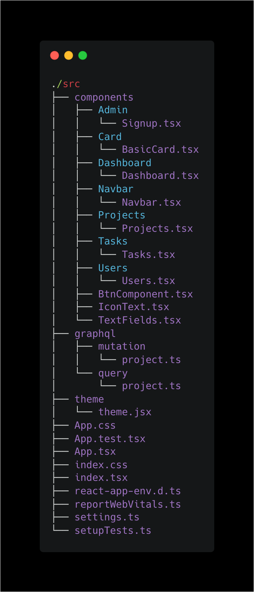

# Bienvenue sur l'application `2109-wns-remote1-redteam-front` 👋🏼


<div style={display:"flex"}>


</div>


## Installation du projet 👇🏼

### Cloner le projet 

>https://github.com/WildCodeSchool/2109-wns-remote1-redteam-front.git

### Installer les dépendances 

Toutes les dépendances du projet se trouve dans le fichier package.json 

Lancer la commande : 
``` 
npm install 
```

## Lancement du projet 👇🏼

### Démarrer 💪🏼
```
npm start 
```

Le projet est disponible sur le port 
> http://localhost:3000


## Structure du projet 🤯

### Dossier SRC


#### Dossier components 🗂

Les composants vous permettent de découper l’interface utilisateur en éléments indépendants et réutilisables, vous permettant ainsi de considérer chaque élément de manière isolée. 
#### Dossier graphql 🗂

Le dossier graphQl est structuré en 2 parties. 

Le dossier query comporte la définition de toutes nos queries vers l'API pour récupérer les données (équivalent du GET en REST)

Le dossier mutations comporte la définition de toutes nos mutations  vers l'API pour envoyer de la données (équivalent du POST, PUT, DELETE en REST)

#### Dossier theme 🗂

    Ce dossier comporte le fichier de theming mis à disposition par MaterialUI. Il permet de définir des propriétés globales de style réutilisable par tout nos          composants.

    #### Fichiers 

    #### App.tsx 
      Le composant « App » du fichier « App. tsx » est notre composant root de base. Il permet d'importer les autres composants pour afficher le rendu.


[Source Badge](https://github.com/alexandresanlim/Badges4-README.md-Profile)
